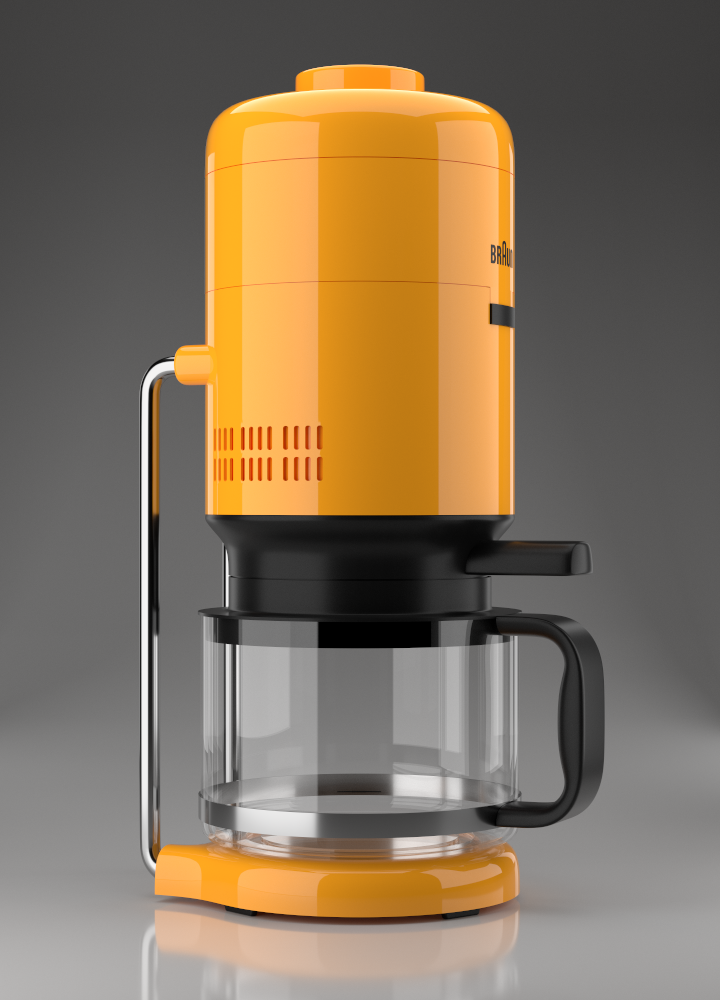

## usd-assets

A collection of USD assets with different material formats for educational and testing purposes.

<table>
    <thead>
        <tr>
            <th>Preview</th>
            <th>Name</th>
            <th>PreviewSurface?</th>
            <th>MaterialX?</th>
            <th>MDL?</th>
            <th>Textures?</th>
            <th>#Faces</th>
            <th>License</th>
        </tr>
    </thead>
    <tbody>
        <tr>
            <td rowspan=3 align="center">
              
            </td>
            <td rowspan=3>Cornell Box</td>
            <td>✔️</td>
            <td>❌</td>
            <td>❌</td>
            <td rowspan=3>❌</td>
            <td rowspan=3>16</td>
            <td rowspan=3>CC0</td>
        </tr>
        <tr>
            <td>❌</td>
            <td>✔️</td>
            <td>❌</td>
        </tr>
        <tr>
            <td>❌</td>
            <td>❌</td>
            <td>✔️</td>
        </tr>
        <tr>
            <td align="center">
              
            </td>
            <td>Coffeemaker</td>
            <td>✔️</td>
            <td>❌</td>
            <td>❌</td>
            <td>❌</td>
            <td>~230k</td>
            <td>CC-BY</td>
        </tr>
        <tr>
            <td align="center">
              
            </td>
            <td>Utah Teapot</td>
            <td>❌</td>
            <td>✔️</td>
            <td>❌</td>
            <td>❌</td>
            <td>~63k</td>
            <td>CC0</td>
        </tr>
    </tbody>
</table>
