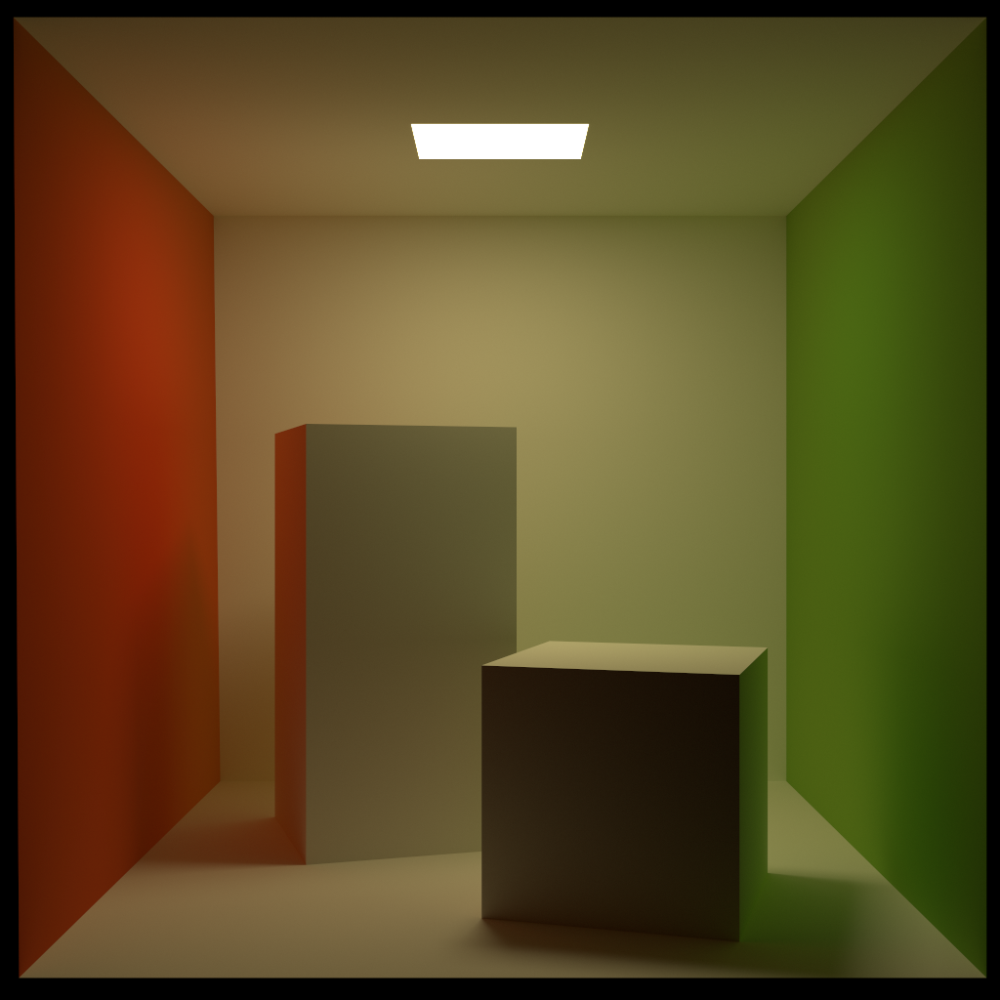

## Cornell Box

  
   
  Example render from <a href="https://github.com/pablode/gatling">gatling</a>.

Creator: Pablo Delgado Krämer

License: CC0 (Public domain)

Faces: 16 quads

Textures: ❌

Versions: MaterialX (File ref.), MaterialX (UsdShade), MDL, UsdPreviewSurface, Display colors

Remarks:
- modelled according to the data from https://www.graphics.cornell.edu/online/box/data.html
- converted centimeters to meters
- correct orientation in default usdview viewport due to root node transform
- lowered light by 1e-3 to avoid overlap with ceiling
- color and emission values consistent with [Morgan McGuire's version](http://casual-effects.com/data/index.html)
