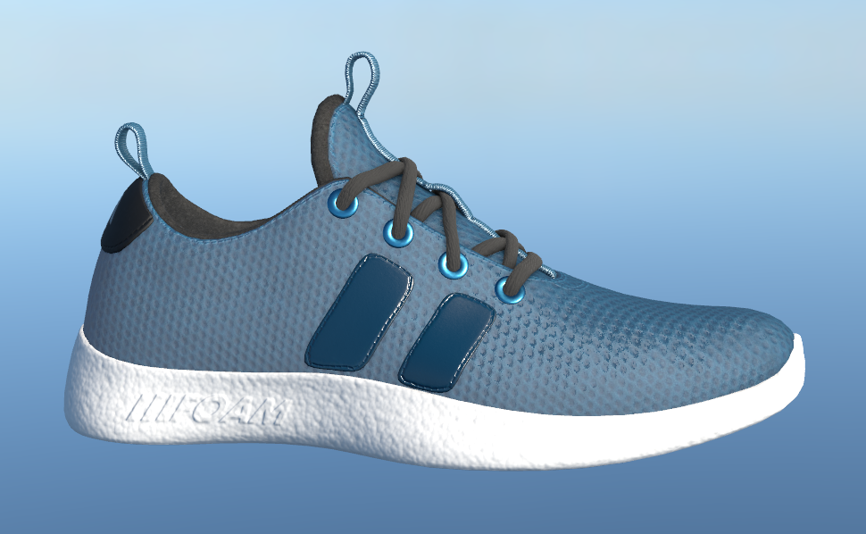

## Materials Variants Shoe

  
   
  Example render from Storm.

Creator: Shopify

License: [CC BY 4.0 International](https://creativecommons.org/licenses/by/4.0/legalcode)

Faces: 22.7k

Textures: ✅

Remarks:
- downloaded from [glTF-Sample-Assets](https://github.com/KhronosGroup/glTF-Sample-Assets/tree/52c9f0e473a523057135281b19d12b768e2f7eb7/Models/MaterialsVariantsShoe) repository
- converted to USD with guc v0.4
- optimized shading networks and scene structure
- this assets uses a dome light and variants
