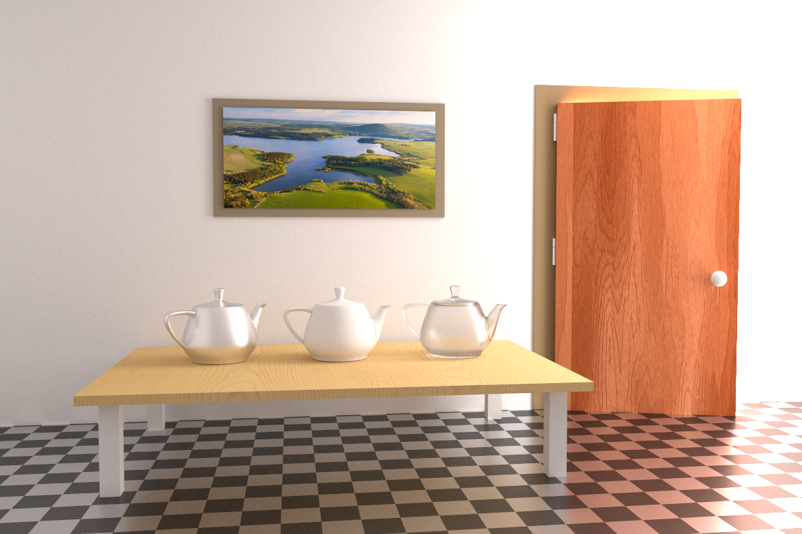

## Veach Ajar

  
   
  Example render from <a href="https://github.com/pablode/gatling">gatling</a>.

Creator: Benedikt Bitterli

License: CC0 (Public domain)

Faces: ~382k

Textures: ✅

Remarks:
- downloaded from [Benedikt Bitterli's Resources](https://benedikt-bitterli.me/resources/)
- imported geometry into Blender
- applied matrix transforms with Blender's Python shell
- added root transform
- added MaterialX materials including procedural checkerboard
